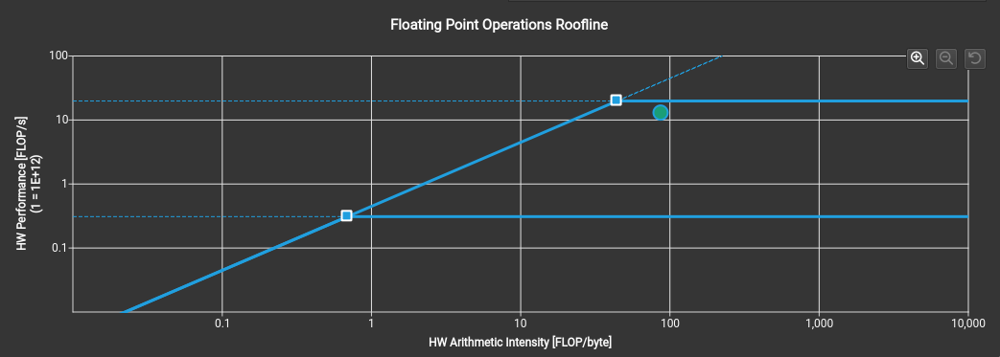
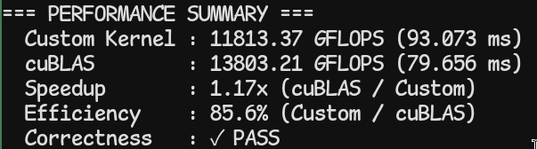

# Experimental Log: CUDA SGEMM Optimization

## 1. Objective

This project investigates the performance of a custom CUDA SGEMM kernel against cuBLAS `SGEMM` as a reference baseline.  
The primary goal is to evaluate whether kernel-level optimizations (tiling, vectorized load/store, and double buffering) can approach cuBLAS throughput while preserving numerical correctness.





## 2. Repository Scope

The repository contains:
- A benchmark driver for custom kernel vs cuBLAS comparison.
- Multiple SGEMM kernel variants for iterative optimization.
- A minimal host-side execution entry for functional checks.

Main files:
- `main_cublas_benchmark.cu`: benchmark runner and correctness/performance report.
- `gemm.cu`: kernel implementations (`naive`, shared-memory tiling, block tiling, vectorized, double buffering, etc.).
- `host.cu`: lightweight functional run path.
- `cuda_check.h`: CUDA error-check helpers.
- `Makefile`: build and run targets.

## 3. Experimental Environment

- OS: Linux / WSL2
- Compiler: `nvcc`
- Library: cuBLAS (`-lcublas`)
- Target architecture (default): `sm_86`

Build flags are defined in `Makefile`:

```bash
NVCC_FLAGS = -O3 -arch=sm_86 --use_fast_math
```

If your GPU architecture differs, update `-arch` accordingly.

## 4. Methodology

### 4.1 Data Layout

All matrices are treated as row-major in host logic.  
For cuBLAS, a row-major wrapper is used by mapping the operation to the equivalent column-major transposed call.

### 4.2 Workload

Default benchmark size:
- `M = 8192, K = 8192, N = 8192`

Optional command-line override:

```bash
./gemm_benchmark M K N
```

### 4.3 Metrics

- Runtime (ms) measured with CUDA events.
- Throughput (GFLOPS):

```text
GFLOPS = (2 * M * N * K) / (time_seconds * 1e9)
```

- Correctness verified against cuBLAS output using absolute and relative error thresholds.

## 5. Reproducibility

Build:

```bash
make            # same as make bench
```

Run benchmark:

```bash
make run
```

Run predefined sizes:

```bash
make run-small  # 256 x 256 x 256
make run-large  # 2048 x 2048 x 2048
```

Build host test executable:

```bash
make host
```

Clean artifacts:

```bash
make clean
```

## 6. Notes

- Current benchmark focuses on single-precision GEMM (`float`).
- The active custom kernel path in benchmark is `sgemm_double_buffering`.
- Additional variants are kept in `gemm.cu` for ablation and iterative tuning.
